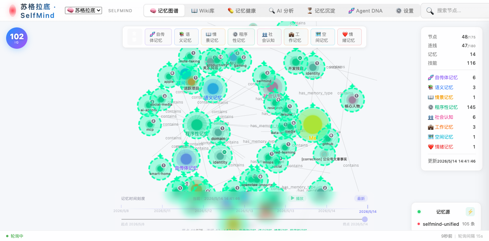
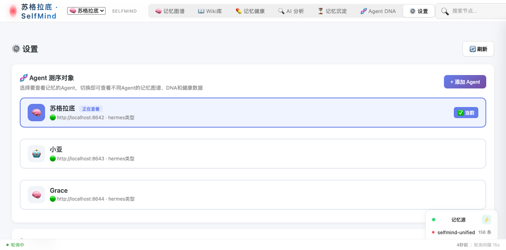
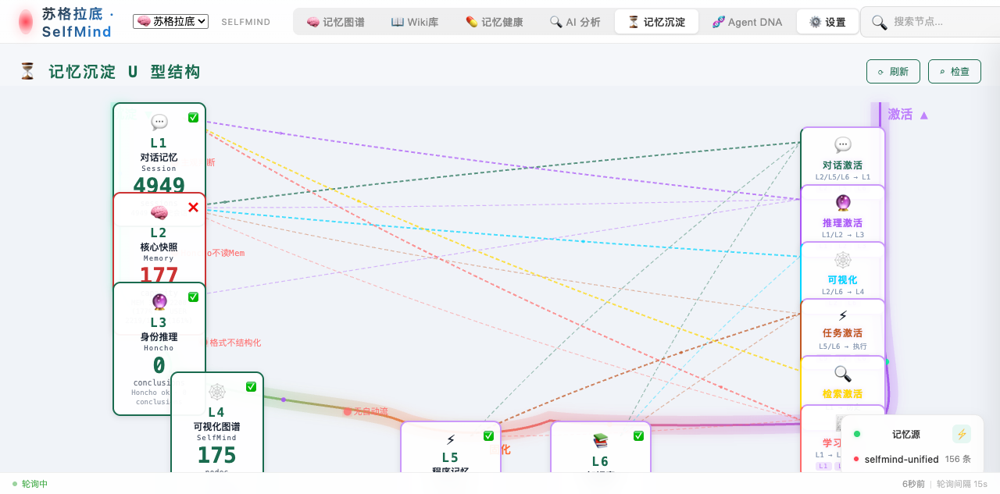
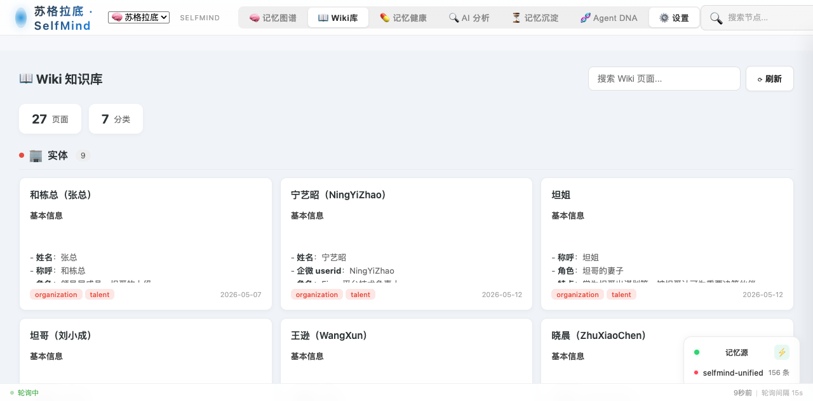
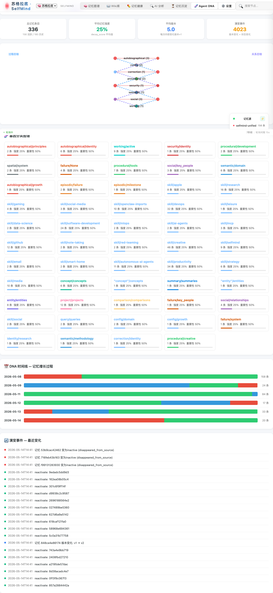

# SelfMind 🧠

**个人专属 AI 记忆库 — 可见 · 可移植 · 可修改**

基于认知心理学的 AI 记忆可视化系统，记录记忆的演变过程。

## 界面预览

<table>
<tr>
<td width="50%"><br/><b>🧠 记忆图谱</b> — D3力导向图，节点按分类聚类，时间线播放演变</td>
<td width="50%"><br/><b>🧬 Agent 测序对象</b> — 一键切换不同Agent，查看各自记忆图谱</td>
</tr>
<tr>
<td width="50%"><br/><b>⏳ 记忆沉淀</b> — U型6层沉淀路径，实时健康指标+激活射线</td>
<td width="50%"><br/><b>📖 Wiki库</b> — 卡片式知识浏览，分类筛选+编辑保存</td>
</tr>
<tr>
<td width="100%"><br/><b>🧬 Agent DNA</b> — 记忆基因组成分析+演变事件流+时间线增长</td>
</tr>
</table>

## Agent DNA

SelfMind 不是 DNA 本身，而是 **agent 的 DNA 测序仪**。

Agent（Hermes、OpenClaw 等）在使用过程中会沉淀独特的记忆模式和行为特征——这就是它的 "DNA"。SelfMind 记录、分析、可视化这些 DNA 的演变过程：

- **过程态链** — 记录演变：首次出现、版本号、更新时间、衰减强度
- **关系态链** — 记录连接：分类、来源、类型
- **碱基对** — 记忆条目内容本身

不同 agent 使用久了会形成不同的记忆基因组合，SelfMind 让你能看见、理解、干预这个演化过程。

详见 [Agent DNA 设计](docs/AGENT_DNA.md)

## 核心功能

| 功能 | 说明 |
|------|------|
| 🧠 记忆图谱 | D3力导向图可视化，节点分类聚类，时间线播放记忆演变 |
| 🧬 Agent切换 | 标题区下拉菜单一键切换不同Agent（苏格拉底/小亚/Grace等），图谱+DNA+健康数据联动刷新 |
| 🔍 Gateway发现 | 设置页输入Gateway地址自动探测Agent信息，路径验证+自动填充 |
| ⏳ 记忆沉淀 | U型6层沉淀路径（L1对话→L2快照→L3推理→L4图谱→L5程序→L6知识），实时健康指标 |
| 📖 Wiki库 | 卡片式知识浏览，分类筛选+详情弹窗+markdown渲染+编辑保存 |
| 💊 记忆健康 | 衰减预警、遗忘曲线、演变追踪，SQLite统一数据源 |
| 🧬 Agent DNA | 记忆基因组成条形图+分类强度+演变事件流+DNA时间线 |
| 🔄 自动同步 | 5分钟间隔自动sync，前端15秒轮询检测变化 |
| 🐳 Docker部署 | 纯Python stdlib，零pip install，一键容器化启动 |

## Quick Start

### Docker 部署（推荐）

SelfMind 已完整 Docker 化，一键启动即可运行：

```bash
# 1. 克隆仓库
git clone https://github.com/xchliu/selfmind.git
cd selfmind

# 2. 配置环境变量
cp .env.example .env
# 编辑 .env，设置你的数据目录路径和 LLM 配置
# 必须调整的项目：
#   - MEMORIES_PATH   → 你的 agent 记忆文件目录（如 ~/.hermes/memories）
#   - SKILLS_PATH     → 你的 agent 技能目录（如 ~/.hermes/skills）
#   - WIKI_PATH       → 你的 Wiki 知识库目录
#   - LLM_API_KEY     → AI 分析功能需要的 API Key（可选）

# 3. (可选) 自定义配置
cp config.example.json config.json
# 编辑 config.json，调整分类、wiki 路径等

# 4. 构建并启动
docker compose up -d --build

# 5. 查看运行状态
docker compose ps
# 或查看日志
docker compose logs -f selfmind

# 6. 打开浏览器
open http://localhost:3002
```

**Docker 架构说明：**

| 配置 | 说明 |
|------|------|
| 纯 Python stdlib | 无 pip install，镜像体积小 |
| 数据持久化 | `./data` 目录 bind-mount，SQLite 数据不丢失 |
| Agent 目录挂载 | 记忆、技能、Wiki 目录以只读方式挂载进容器 |
| 配置挂载 | `config.json` 挂载为只读，容器内生效 |
| 健康检查 | 内置 `/api/stats` 探针，自动检测服务状态 |
| Host 通信 | `host.docker.internal` 可访问宿主机 Honcho 等服务 |

**停止与更新：**

```bash
# 停止服务
docker compose down

# 更新代码后重新构建
docker compose up -d --build

# 仅重启（不重建）
docker compose restart
```

### 本地运行

```bash
# 1. 克隆仓库
git clone https://github.com/xchliu/selfmind.git
cd selfmind

# 2. (可选) 自定义配置
cp config.example.json config.json

# 3. 直接启动（纯Python，无需pip install）
python3 server.py

# 4. 打开浏览器
open http://localhost:3002
```

### 添加更多 Agent

SelfMind 支持同时查看多个 Agent 的记忆。每个 Agent 需要有独立的 Hermes gateway：

1. 创建新 profile：`hermes setup --profile <name>`
2. 配置 gateway 端口：在 profile 的 config.yaml 加 `API_SERVER_ENABLED: true` + `API_SERVER_PORT: <port>`
3. 启动 gateway：`HERMES_HOME=~/.hermes/profiles/<name> hermes gateway`
4. SelfMind 设置页输入 Gateway 地址 → 点击探测 → 自动发现 → 确认添加

切换 Agent：标题区下拉菜单一键切换，图谱、DNA、健康数据联动刷新。

端口分配建议：hermes=8642, aris=8643, grace=8644, 依次递增。

## 环境变量

| 变量 | 默认值 | 说明 |
|---|---|---|
| `SELFMIND_PORT` | 3002 | 服务端口 |
| `MEMORIES_PATH` | ~/.hermes/memories | 记忆文件目录 |
| `SKILLS_PATH` | ~/.hermes/skills | 技能文件目录 |
| `WIKI_PATH` | ~/Documents/aiworkspace/wiki | Wiki知识库目录 |
| `HONCHO_ENABLED` | true | 是否启用Honcho数据源 |
| `HONCHO_API_URL` | http://host.docker.internal:8000/v3 | Honcho API地址 |
| `LLM_BASE_URL` | https://api.openai.com/v1 | LLM API地址（AI分析功能需要） |
| `LLM_API_KEY` | （空） | LLM API密钥 |
| `LLM_MODEL` | gpt-4o-mini | LLM 模型名称 |

详见 [.env.example](.env.example)

## 数据源

SelfMind 从4个数据源采集记忆：

1. **记忆文件** — MEMORY.md / USER.md（§分隔条目 + [分类/子类]标签）
2. **Wiki知识库** — markdown文件（YAML frontmatter + 内容）
3. **Honcho**（可选） — 语义观察、归纳推理、矛盾检测
4. **技能目录** — SKILL.md文件（YAML frontmatter）

所有数据源统一采集到 SQLite，记录演变过程（版本号、衰减分、时间线）。

## 文档

- [完整README](docs/README.md) — 特性详解、架构说明
- [Agent DNA 设计](docs/AGENT_DNA.md) — DNA 概念、闭环流程、可视化规划
- [产品需求文档](docs/PRD.md)
- [路线图](docs/ROADMAP.md)
- [更新日志](docs/CHANGELOG.md)
- [记忆分类设计](docs/MEMORY_TAXONOMY.md)

## License

MIT